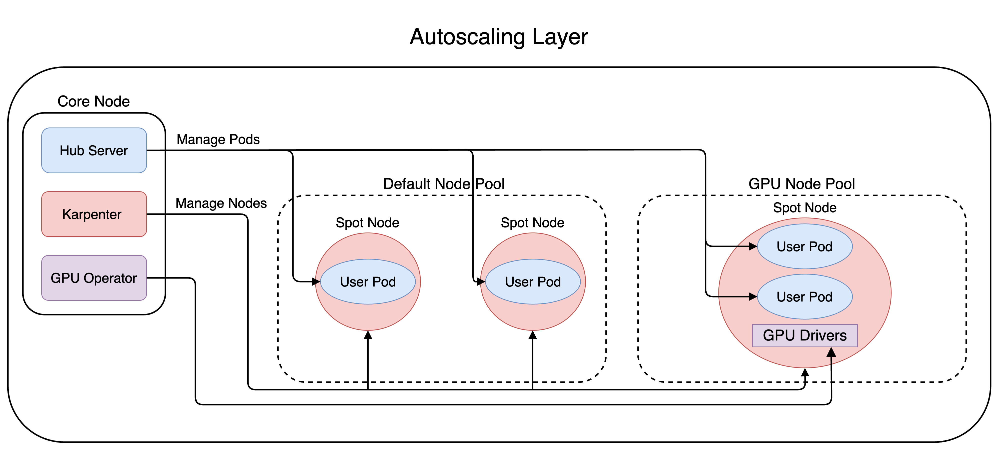

# Deployment Architecture

A deployment of this project creates a core set of system-components that are intended to always be active, as well as dynamically creates set of virtual server for each active user.

The core components are responsible for managing the dynamic components.

All images in this doc can be viewed/edited via [draw.io](https://app.diagrams.net/#G1AutjQn7oE7zq2Coj9ujn9g8HhteyLY_d)

## Autoscaling

Here we see the actions that occur when a user requests a new Jupyerlab Server.

1. The user selects one of the server profile options
2. The Hub begins the process by creating a [Kubernetes Pod](https://kubernetes.io/docs/concepts/workloads/pods/)
3. If there is room to schedule the pod on an existing [Kubernete Node](https://kubernetes.io/docs/concepts/architecture/nodes/), its is started there.
   Otherwise, a new [Karpenter Node Claim](https://karpenter.sh/docs/concepts/nodeclaims/) is
   created.
4. Karpenter ensures that there is a Node to fulfill each NodeClaim.
   If there are not enough Nodes, Karpenter will create a new one (in our case, an AWS EC2 instance)
5. Once the Node is ready, the Pod starts up

Here we see the actions that occur when a user stops using their server.

1. The user either deletes their server, or is idle for more than the timeout (default 1 hour).
2. The Hub recieves the request from the user, or from the culler, and deletes the pod.
3. If the Node is now empty (drained) Karpenter deletes the Node/EC2 instance.

## Traffic

All traffic is routed through DNS (AWS Route 53) to a load balancer, which distributes the traffic
either to the Hub server, or to the a specific JupyterLab Pod.

