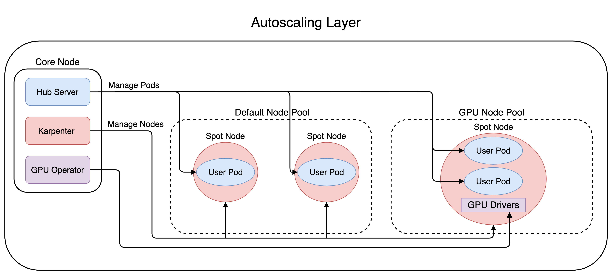
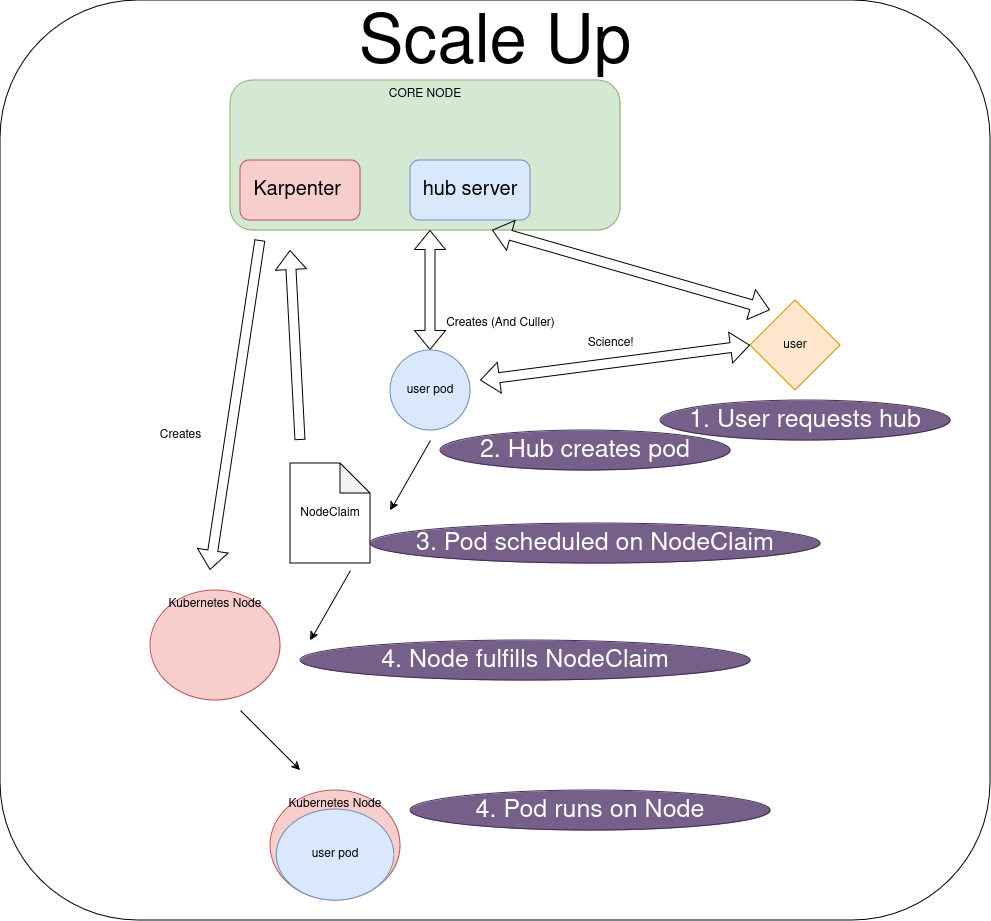
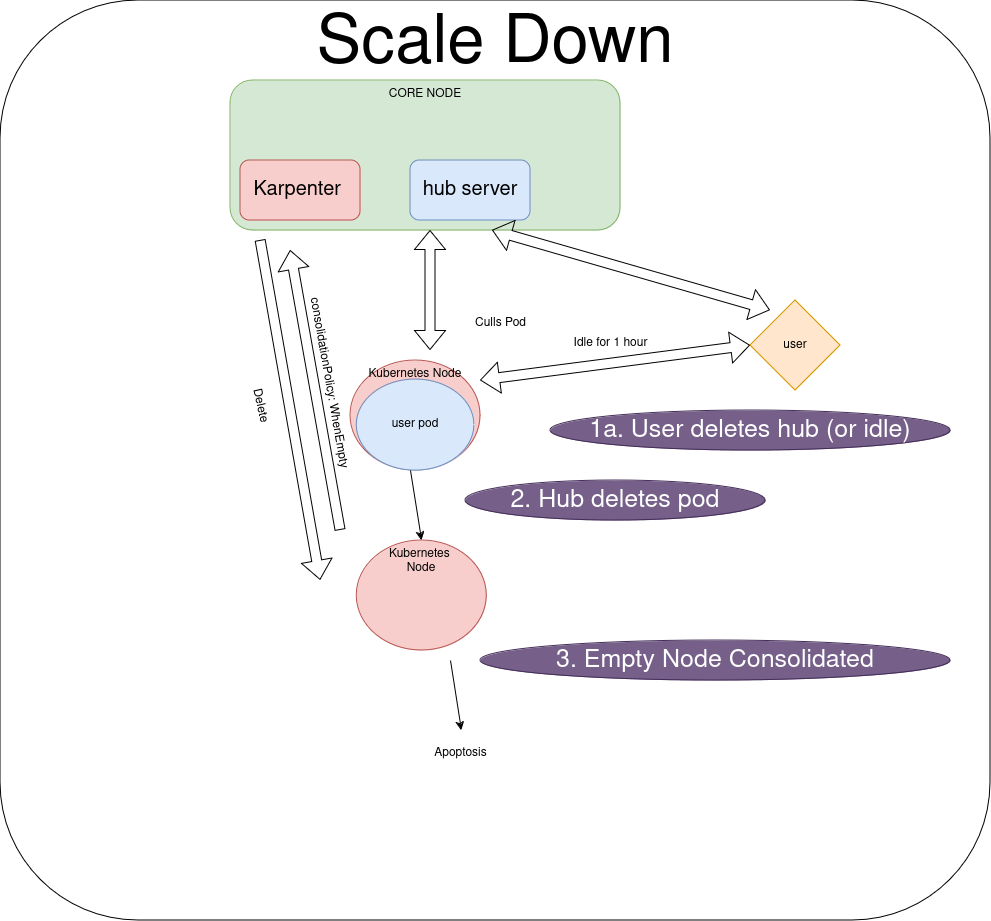
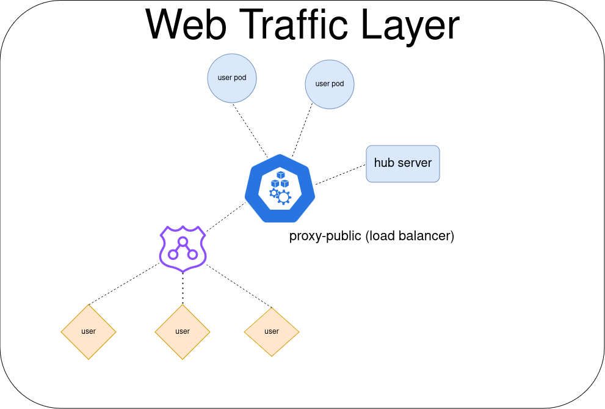

# Deployment Architecture

A deployment of this project creates a set of core and dynamic system components.  The core components are intended to always be active and are responsible for managing the dynamic components.  The dynamic components are virtual servers for each active user.

All images in this doc were generated with [draw.io](https://www.drawio.com) and are saved in [architecture.drawio](static/architecture.drawio).

## Autoscaling

Below we see the actions that occur when a user requests a new Jupyerlab Server.

1. The user selects one of the server profile options
2. The Hub begins the process by creating a [Kubernetes Pod](https://kubernetes.io/docs/concepts/workloads/pods/)
3. If there is room to schedule the pod on an existing [Kubernetes Node](https://kubernetes.io/docs/concepts/architecture/nodes/), it is started there.
   Otherwise, a new [Karpenter Node Claim](https://karpenter.sh/docs/concepts/nodeclaims/) is
   created.
4. Karpenter ensures that there is a Node to fulfill each NodeClaim.
   If there are not enough Nodes, Karpenter will create a new one (in our case, an AWS EC2 instance).
5. Once the Node is ready, the Pod starts up

Below we see the actions that occur when a user stops using their server.

1. The user either deletes their server, or is idle for more than the timeout (default 1 hour).
2. The Hub recieves the request from the user, or from the culler, and deletes the pod.
3. If the Node is now empty (drained) Karpenter deletes the Node/EC2 instance.

## Traffic

All traffic is routed through DNS (AWS Route 53) to a load balancer, which distributes the traffic
either to the Hub server, or to the a specific JupyterLab Pod.

